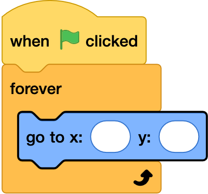
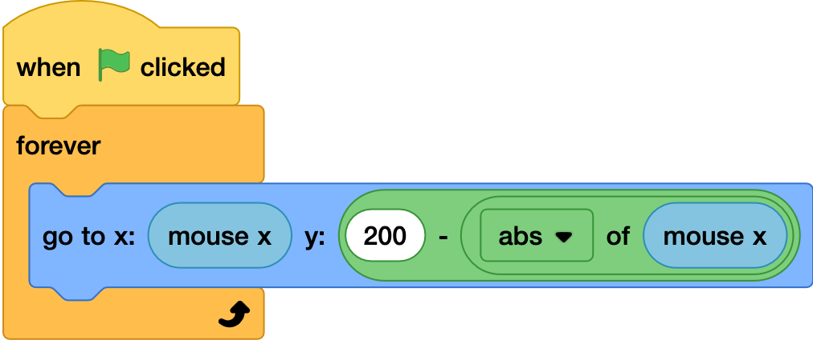

## Moving the sun

--- task ---

Open the starter project 
--- /task ---

--- task ---

In the Sun sprite add the following code to change the x movemnt of the sun sprite with your mouse.
--- /task ---

--- task ---

Test the code by pressing the green flag - the sun should follow your mouse movment from side to side
--- /task ---

--- task ---
In the y BOX?? input a minus operator, and add 200 into the first box
--- /task ---

--- task ---
drag in a abs of for the second box, and use the mouse x. This moves the mouse in an arc accross the sky.
--- /task ---

--- task ---
test your code again - the sun should start low, and then rise and fall in a arc shape.
--- /task ---
