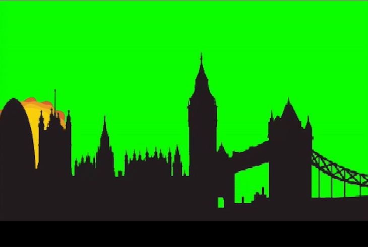
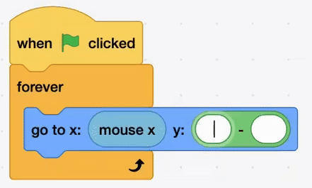

## Move the sun

<div style="display: flex; flex-wrap: wrap">
<div style="flex-basis: 200px; flex-grow: 1; margin-right: 15px;">
Make the sun move across the sky
</div>
<div>

{:width="300px"}

</div>
</div>

<html>
<div style="position: relative; width: 100%; aspect-ratio: 16 / 9; border-radius: 20px; box-shadow: 0 0 15px #3fb654; overflow: hidden;">
<iframe style="position: absolute; top: 0; left: 0; right: 0; width: 100%; height: 100%; border: none;" src="https://www.youtube.com/embed/t5UzLuTj_CE?rel=0&cc_load_policy=1" allowfullscreen allow="accelerometer; autoplay; clipboard-write; encrypted-media; gyroscope; picture-in-picture; web-share">
</iframe>
</div><br>
</html>
<div style="text-align: center; margin-top: 1em;">

Play, pause, make. Follow the project on our [YouTube](9) playlist!
</div>
### Get started

--- task ---
Open the [starter project](http://rpf.io/sunset-go){:target="_blank"}.
--- /task ---


--- task ---
Select the **Sun** sprite 
--- /task ---


--- task ---
From the `Events`{:class="block3events"} block menu, drag the `When flag clicked`{:class="block3events"} block to the Code area.

```blocks3
+when green flag clicked
```
--- /task ---


--- task ---
From the `Control`{:class="block3control"} menu drag a `forever`{:class="block3control"} block under the `when this sprite clicked`{:class="block3events"}. 

```blocks3
when green flag clicked
+forever 
```

The blocks will snap together.
--- /task ---

### Add motion

--- task ---
From the `Motion`{:class="block3motion"} menu drag an `go to x: y:`{:class="block3motion"} block inside the `forever`{:class="block3control"} block. 

```blocks3
when green flag clicked
forever 
+go to x: () y: ()
```
--- /task ---

--- task ---
The `go to x: y:`{:class="block3motion"} block has two empty fields. In the first drag in a `mouse x`{:class="block3sensing"}. 

In the second field drag in a `minus`{:class="block3operators"} block.

```blocks3
when green flag clicked
forever 
+go to x: (mouse x) y: (()-())
```
--- /task ---


**Tip:** drop the blocks in just below the empty field


### Make an arc

--- task ---
In the `minus`{:class="block3operators"} block type in **200** to the first field. 



Drag an `abs of`{:class="block3operators"} block in the second.

```blocks3
when green flag clicked
forever 
+go to x: (mouse x) y: ((200)-([abs v] of()))
```
--- /task ---


--- task ---
Drag and drop a `mouse x`{:class="block3motion"} into the `abs of`{:class="block3operators"} block.
```blocks3
when green flag clicked
forever 
+go to x: (mouse x) y: ((200)-([abs v] of(mouse x)))
```
--- /task ---


--- task ---
**Test:** click the green flag and check that the sun moves.
--- /task ---
