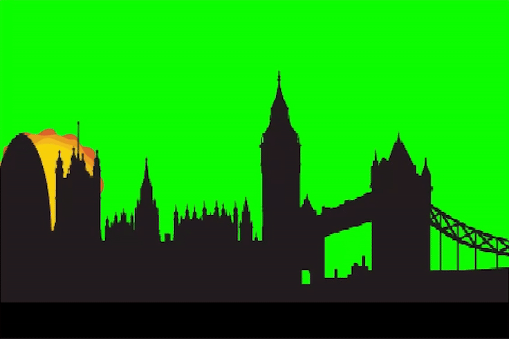

## Make it grow

<div style="display: flex; flex-wrap: wrap">
<div style="flex-basis: 200px; flex-grow: 1; margin-right: 15px;">
Make the sun grow and shrink as it moves accross the sky
</div>
<div>

{:width="300px"}

</div>
</div>

<html>
<div style="position: relative; width: 100%; aspect-ratio: 16 / 9; border-radius: 20px; box-shadow: 0 0 15px #3fb654; overflow: hidden;">
<iframe style="position: absolute; top: 0; left: 0; right: 0; width: 100%; height: 100%; border: none;" src="https://www.youtube.com/embed/cJWVlXorCWs?rel=0&cc_load_policy=1" allowfullscreen allow="accelerometer; autoplay; clipboard-write; encrypted-media; gyroscope; picture-in-picture; web-share">
</iframe>
</div><br>
</html>
<div style="text-align: center; margin-top: 1em;">

Play, pause, make. Follow the project on our [YouTube](9) playlist!
</div>

### Set size

--- task ---
From the `looks`{:class="block3looks"} menu add the `set size`{:class="block3looks"} block.

```blocks3
when green flag clicked
forever
 go to x: (mouse x) y: ((200) - ([abs v] of (mouse x)))
+ set size to () %
```
--- /task ---


--- task ---
Add a `plus`{:class="block3operators"} block into the set size.

```blocks3
when green flag clicked
forever
 go to x: (mouse x) y: ((200) - ([abs v] of (mouse x)))
+ set size to (() + ()) %
```
--- /task ---

### Make it grow

--- task ---
In the first field type in **50**. 

In the second field add an `abs of`{:class="block3operators"} block.

```blocks3
when green flag clicked
forever
 go to x: (mouse x) y: ((200) - ([abs v] of (mouse x)))
+ set size to ((50) + ([abs v] of ())) %
```
--- /task ---


--- task ---
Add a `divide`{:class="block3operators"} block to the `abs of`{:class="block3operators"}.

```blocks3
when green flag clicked
forever
 go to x: (mouse x) y: ((200) - ([abs v] of (mouse x)))
+ set size to ((50) + ([abs v] of (() / ()))) %
```
--- /task ---

--- task ---
Add a `mouse x`{:class="block3sensing"}.

Type the number **4** into to the empty fields. 

```blocks3
when green flag clicked
forever
 go to x: (mouse x) y: ((200) - ([abs v] of (mouse x)))
+ set size to ((50) + ([abs v] of ((mouse x) / (4)))) %
```
--- /task ---

--- task ---
**Test:** check that the sun grows and shriks. Experiment with diffenrt numbers to divide by to how you want to change the size
--- /task ---