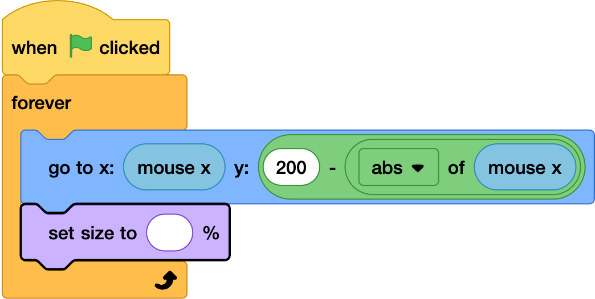

## Size of the sun

--- task ---
Add the following block
--- /task ---

--- task ---
In the input add a plus operator. type 50 in the first field.
--- /task ---

--- task ---
in the second field use a abs of, and put in the mouse x / 4. 
--- /task ---

--- task ---
Test you code and play around with diffenrt numbers to divide the mouse x by to how you want to change the size
--- /task ---