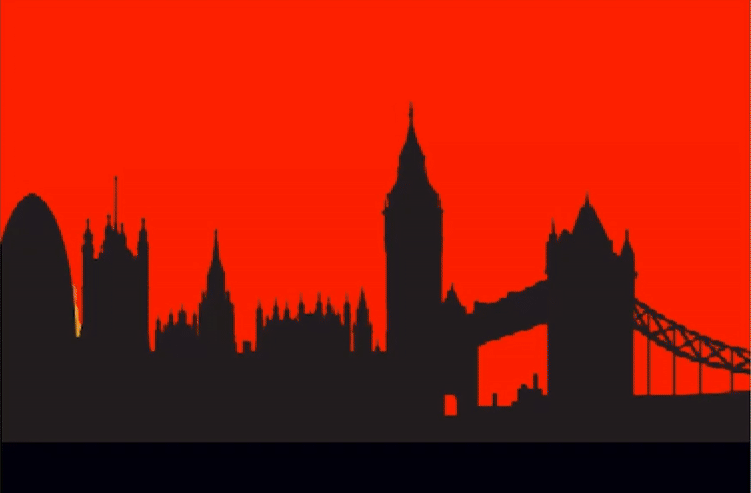
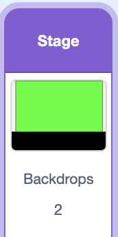
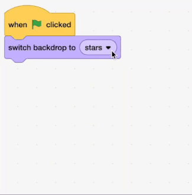

## Change the colour

<div style="display: flex; flex-wrap: wrap">
<div style="flex-basis: 200px; flex-grow: 1; margin-right: 15px;">
Make the sky change colour
</div>
<div>

{:width="300px"}

</div>
</div>

<html>
<div style="position: relative; width: 100%; aspect-ratio: 16 / 9; border-radius: 20px; box-shadow: 0 0 15px #3fb654; overflow: hidden;">
<iframe style="position: absolute; top: 0; left: 0; right: 0; width: 100%; height: 100%; border: none;" src="https://www.youtube.com/embed/HSZQlOlowyg?rel=0&cc_load_policy=1" allowfullscreen allow="accelerometer; autoplay; clipboard-write; encrypted-media; gyroscope; picture-in-picture; web-share">
</iframe>
</div><br>
</html>


--- task ---
Select the backdrop from the stage pane. 


--- /task ---

--- task ---
Drag a `when flag clicked` block into the Code area

+ when green flag clicked
--- /task ---

--- task ---
From the `Looks` block menu drag a `switch backdrop to` block.

when green flag clicked
+switch backdrop to (sunset v)

Choose sunset from the dropdown menu.

--- /task ---


--- task ---
Add a `set colour effect` block from the `Looks` menu

```blocks3
when green flag clicked
switch backdrop to (sunset v)
forever
set [color v] effect to ((mouse x) / (4))
end
```
--- /task ---

--- task ---
In the `set colour effect` block add a `divided by` operator block. Drag and drop `mouse x` into the first field and type 4 to the second. 

```blocks3
when green flag clicked
switch backdrop to (sunset v)
forever
set [color v] effect to ((mouse x) / (4))
end
```
--- /task ---


--- task ---
**Test:** You can play aournd with the colours be chaning the number 4 until you find a colour range that you like
--- /task ---
