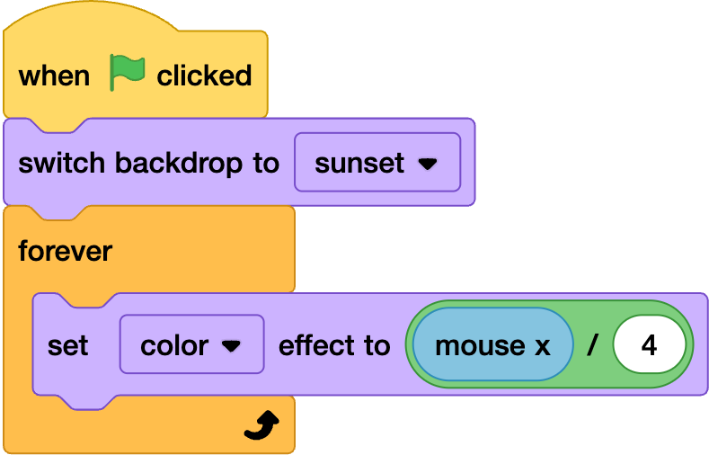

## Red sky at night

--- task ---
In the backdrops code tab add the following code

--- /task ---

--- task ---
in the colour effect add a divided by operator and mouse x and 4. 

--- /task ---

--- task ---
test this and play aournd with teh numbers until you find a colour range you are happy with
--- /task ---
