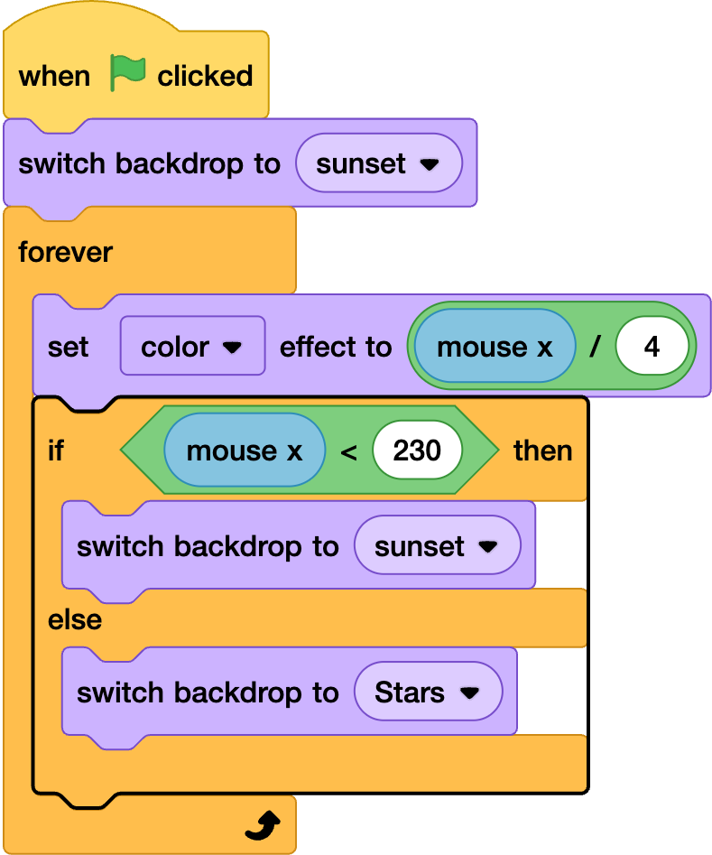

## The midnight hour

<div style="display: flex; flex-wrap: wrap">
<div style="flex-basis: 200px; flex-grow: 1; margin-right: 15px;">
Make the stars come out at night
</div>
<div>

{:width="300px"}

</div>
</div>

<html>
<div style="position: relative; width: 100%; aspect-ratio: 16 / 9; border-radius: 20px; box-shadow: 0 0 15px #3fb654; overflow: hidden;">
<iframe style="position: absolute; top: 0; left: 0; right: 0; width: 100%; height: 100%; border: none;" src="https://www.youtube.com/embed/wZU1QGnKG8c?rel=0&cc_load_policy=1" allowfullscreen allow="accelerometer; autoplay; clipboard-write; encrypted-media; gyroscope; picture-in-picture; web-share">
</iframe>
</div><br>
</html>

--- task ---
Add an if else block.
```blocks3
when green flag clicked
switch backdrop to (sunset v)
forever
set [color v] effect to ((mouse x) / (4))
+if <> then
else
end
end
```

--- /task ---

--- task ---
In the ad a less than opertor, this has a '<'. Add mouse x and 230 to this.  
```blocks3
when green flag clicked
switch backdrop to (sunset v)
forever
set [color v] effect to ((mouse x) / (4))
if <(mouse x) < (230)> then
else
end
end
```
--- /task ---

--- task ---
Drag switch backdrop under the if and set the backdrop to sunset on the dropdown menu. Also drag a switch backdrop to under the else, but set this to Stars.
```blocks3
when green flag clicked
switch backdrop to (sunset v)
forever
set [color v] effect to ((mouse x) / (4))
if <(mouse x) < (230)> then
+switch backdrop to (sunset v)
else
+switch backdrop to (Stars v)
end
end
```
--- /task ---

ADD GIF OF MENU HERE



--- task ---
Test it out. The backdrop should change `if` mouse x is great than 230. 
--- /task ---
