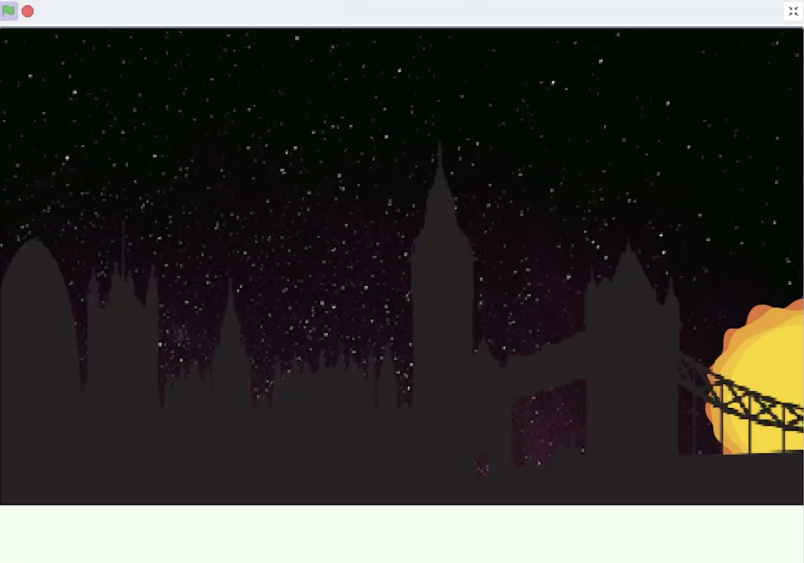
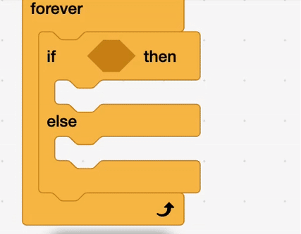

## Night sky

<div style="display: flex; flex-wrap: wrap">
<div style="flex-basis: 200px; flex-grow: 1; margin-right: 15px;">
Switch to a night sky
</div>
<div>

{:width="300px"}

</div>
</div>

<html>
<div style="position: relative; width: 100%; aspect-ratio: 16 / 9; border-radius: 20px; box-shadow: 0 0 15px #3fb654; overflow: hidden;">
<iframe style="position: absolute; top: 0; left: 0; right: 0; width: 100%; height: 100%; border: none;" src="https://www.youtube.com/embed/lcpz71DtCxc?rel=0&cc_load_policy=1" allowfullscreen allow="accelerometer; autoplay; clipboard-write; encrypted-media; gyroscope; picture-in-picture; web-share">
</iframe>
</div><br>
</html>
<div style="text-align: center; margin-top: 1em;">

Play, pause, make. Follow the project on our [YouTube](10) playlist!
</div>

### Add an "if else"

--- task ---
Add an `if else`{:class="block3control"} block.

```blocks3
when green flag clicked
switch backdrop to (sunset v)
forever
set [color v] effect to ((mouse x) / (4))
+if <> then
else
end
end
```

--- /task ---

--- task ---
Add a `less than`{:class="block3operators"} block. 



--- /task ---

--- task ---

Add `mouse x`{:class="block3sensing"} block into the first field.

Type **230** into the second field.  

```blocks3
when green flag clicked
switch backdrop to (sunset v)
forever
set [color v] effect to ((mouse x) / (4))
+if <(mouse x) < (230)> then
else
end
end
```
--- /task ---

### Switch backdrop

--- task ---
Drag a `switch backdrop`{:class="block3looks"}, and set to **sunset**.

Drag a `switch backdrop`{:class="block3looks"}, and set this to **Stars**.

```blocks3
when green flag clicked
switch backdrop to (sunset v)
forever
set [color v] effect to ((mouse x) / (4))
if <(mouse x) < (230)> then
+switch backdrop to (sunset v)
else
+switch backdrop to (Stars v)
end
end
```
--- /task ---

--- task ---
**Test:** Check that the backdrop changes when the mouse is more than **230**. 
--- /task ---

