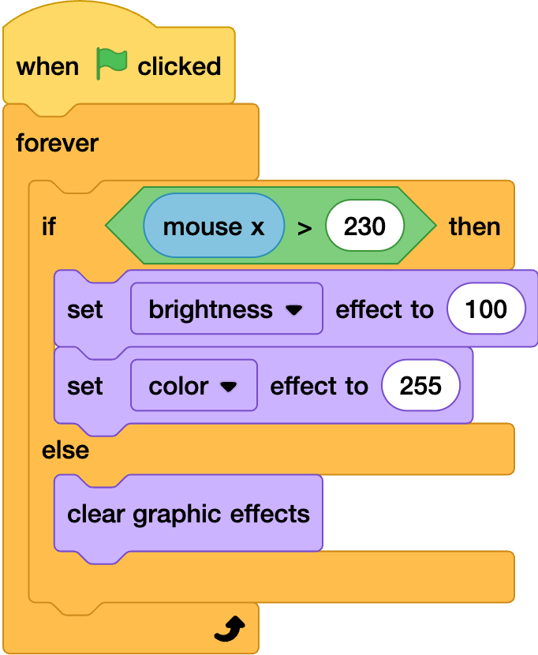

## City lights

--- task ---
In the city sprite add the follwoing blocks
Add an great than operator and mouse x and NUM??
--- /task ---

--- task ---
test code and change the brightness and colour affect to make your city light up at night
--- /task ---

