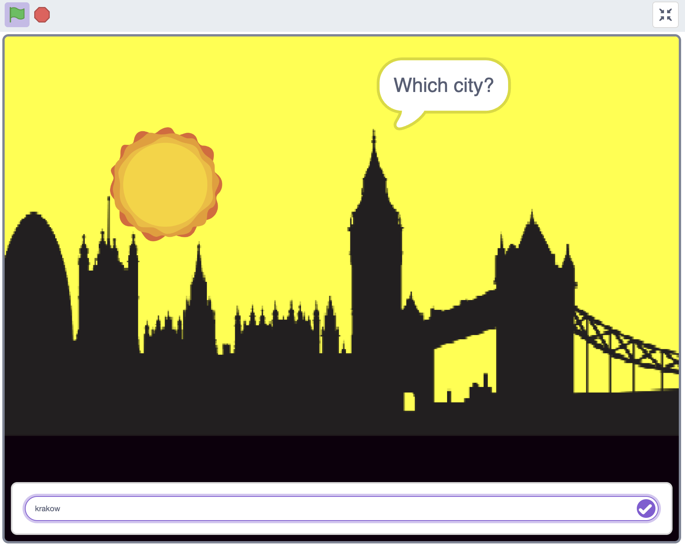
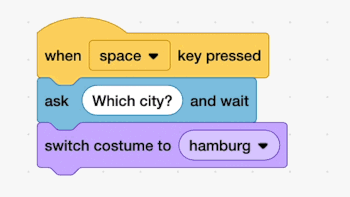

## Switch cities

<div style="display: flex; flex-wrap: wrap">
<div style="flex-basis: 200px; flex-grow: 1; margin-right: 15px;">
Switch cities
</div>
<div>

{:width="300px"}

</div>
</div>

<html>
<div style="position: relative; width: 100%; aspect-ratio: 16 / 9; border-radius: 20px; box-shadow: 0 0 15px #3fb654; overflow: hidden;">
<iframe style="position: absolute; top: 0; left: 0; right: 0; width: 100%; height: 100%; border: none;" src="https://www.youtube.com/embed/AtKv-CLsiS4?rel=0&cc_load_policy=1" allowfullscreen allow="accelerometer; autoplay; clipboard-write; encrypted-media; gyroscope; picture-in-picture; web-share">
</iframe>
</div><br>
</html>


--- task ---
Drag the `when space key pressed` from the event blocks.

```blocks3
+when [space v] key pressed
```
--- /task ---

--- task ---
Add the `ask and wait` block, then type in "Which city?"
```blocks3
when [space v] key pressed
+ask [Which city?] and wait
```

--- /task ---

--- task ---
Drag a `switch costume` to block from the `Looks` menu and put the `answer` block in the empty field
```blocks3
when [space v] key pressed
ask [Which city?] and wait
+switch costume to (answer)
```
--- /task ---

change gif
