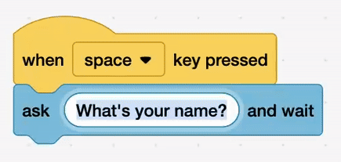

## Switch cities

<div style="display: flex; flex-wrap: wrap">
<div style="flex-basis: 200px; flex-grow: 1; margin-right: 15px;">
Switch cities
</div>
<div>

{:width="300px"}

</div>
</div>

<html>
<div style="position: relative; width: 100%; aspect-ratio: 16 / 9; border-radius: 20px; box-shadow: 0 0 15px #3fb654; overflow: hidden;">
<iframe style="position: absolute; top: 0; left: 0; right: 0; width: 100%; height: 100%; border: none;" src="https://www.youtube.com/embed/AtKv-CLsiS4?rel=0&cc_load_policy=1" allowfullscreen allow="accelerometer; autoplay; clipboard-write; encrypted-media; gyroscope; picture-in-picture; web-share">
</iframe>
</div><br>
</html>
<div style="text-align: center; margin-top: 1em;">

Play, pause, make. Follow the project on our [YouTube](9) playlist!
</div>

### Ask which city?

--- task ---
Drag the `when space key pressed`{:class="block3events"} from the event blocks.

```blocks3
+when [space v] key pressed
```
--- /task ---

--- task ---
Add the `ask and wait`{:class="block3sensing"} block.

Type in **"Which city?"** into the field

```blocks3
when [space v] key pressed
+ask [Which city?] and wait
```

--- /task ---


**Tip:** delete the text and then type



--- task ---
Drag a `switch costume`{:class="block3looks"} block under.

Drag the `answer`{:class="block3sensing"} block in the empty field.
```blocks3
when [space v] key pressed
ask [Which city?] and wait
+switch costume to (answer)
```
--- /task ---

**Tip:** drag the `answer`{:class="block3sensing"} block over the switch costume menu to insert it


**Test:** check that the ask shows when space pressed. Type a city and check that it changes.