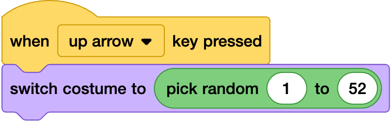

## Travel the world

--- task ---
Add the another event in the city sprite and the following code

--- /task ---

--- task ---
the random will switch to one of the 52 cosutumes - to see these look in the costume tab
--- /task ---
