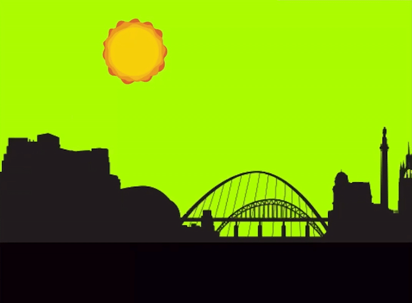
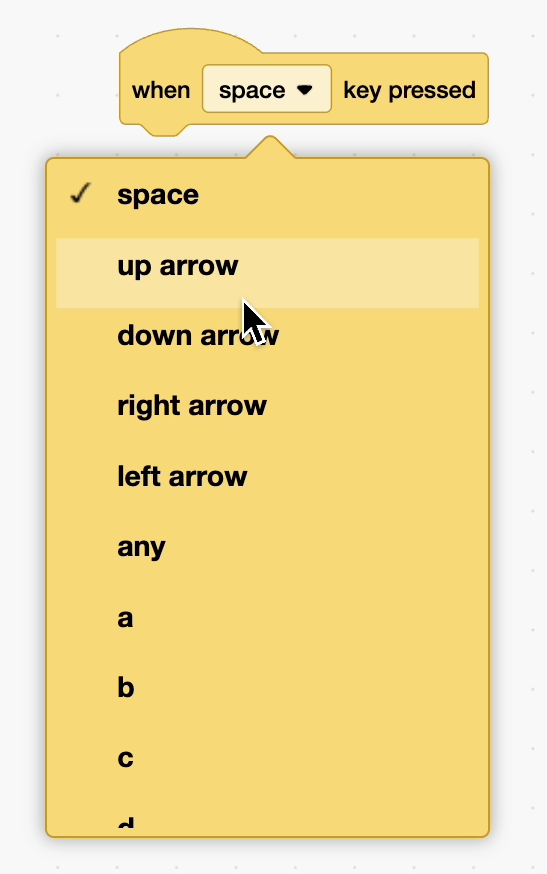

## Travel the world

<div style="display: flex; flex-wrap: wrap">
<div style="flex-basis: 200px; flex-grow: 1; margin-right: 15px;">
Use random to change the city
</div>
<div>

{:width="300px"}

</div>
</div>

<html>
<div style="position: relative; width: 100%; aspect-ratio: 16 / 9; border-radius: 20px; box-shadow: 0 0 15px #3fb654; overflow: hidden;">
<iframe style="position: absolute; top: 0; left: 0; right: 0; width: 100%; height: 100%; border: none;" src="https://www.youtube.com/embed/RBsfvhn9bTQ?rel=0&cc_load_policy=1" allowfullscreen allow="accelerometer; autoplay; clipboard-write; encrypted-media; gyroscope; picture-in-picture; web-share">
</iframe>
</div><br>
</html>
<div style="text-align: center; margin-top: 1em;">

Play, pause, make. Follow the project on our [YouTube](10) playlist!
</div>

### Change cities

--- task ---
Add a `when key pressed`{:class="block3events"} event, and choose up arrow on the menu
```blocks3
+when [up arrow v] key pressed
```

--- /task ---


--- task ---
Add a `switch costume`{:class="block3looks"} block. 

Insert a `pick random number`{:class="block3operators"} into the empty field

```blocks3
when [up arrow v] key pressed
+switch costume to (pick random () to ())
```
--- /task---

--- task ---
Change the numbers so they are between **1** and **52**. 

```blocks3
when [up arrow v] key pressed
+switch costume to (pick random (1) to (52))
```
--- /task ---

**TIP:** To see all the city costumes click on the costume tab


--- task ---
**Test:** check that random cities show when clicking the up arrow. 
--- /task ---

