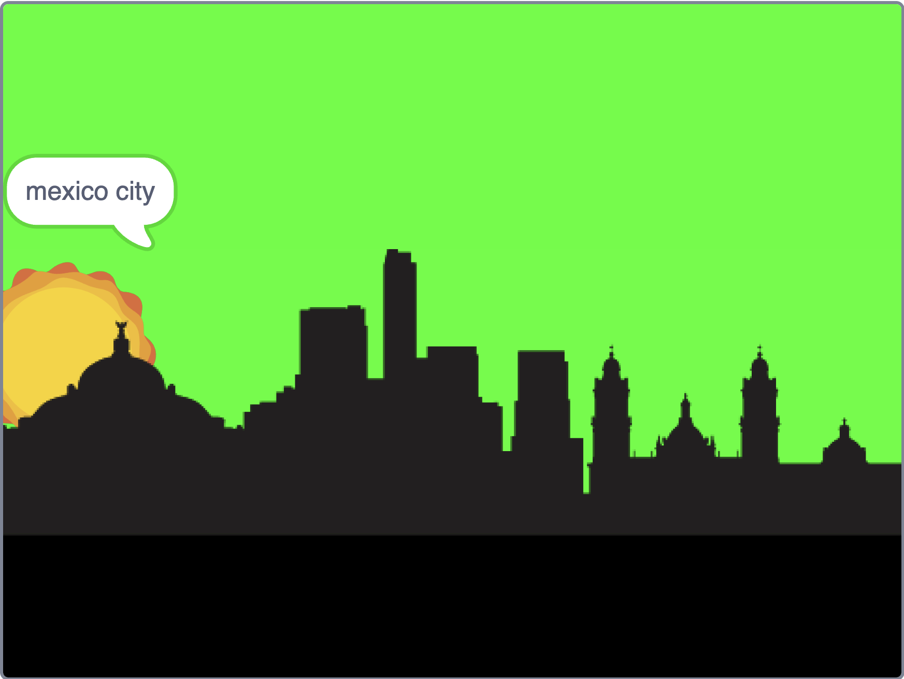

## Where are we?

<div style="display: flex; flex-wrap: wrap">
<div style="flex-basis: 200px; flex-grow: 1; margin-right: 15px;">
Say the name of the city you are in.
</div>
<div>

{:width="300px"}

</div>
</div>

<html>
<div style="position: relative; width: 100%; aspect-ratio: 16 / 9; border-radius: 20px; box-shadow: 0 0 15px #3fb654; overflow: hidden;">
<iframe style="position: absolute; top: 0; left: 0; right: 0; width: 100%; height: 100%; border: none;" src="https://www.youtube.com/embed/-g3lJIF2qHs?rel=0&cc_load_policy=1" allowfullscreen allow="accelerometer; autoplay; clipboard-write; encrypted-media; gyroscope; picture-in-picture; web-share">
</iframe>
</div><br>
</html>
<div style="text-align: center; margin-top: 1em;">

Play, pause, make. Follow the project on our [YouTube](9) playlist!
</div>


### Show the city

--- task ---
From the `events`{:class="block3events"} menu drag a `when key pressed`{:class="block3events"} block.

Choose down arrow from the menu.

```blocks3
+when [down arrow v] key pressed
```
--- /task ---

--- task ---
Add a `say`{:class="block3looks"} block. 

Insert a `costume`{:class="block3looks"} block and choose **name** from the drop down menu. 

```blocks3
when [down arrow v] key pressed
+say (costume [name v]) for (1) seconds
```

--- /task ---

**Tip:** drag ontop of the text in the say block, then choose from the menu


--- task ---
**Test:** press up arrow and check the name of the city costume shows in a speech bubble
--- /task ---
